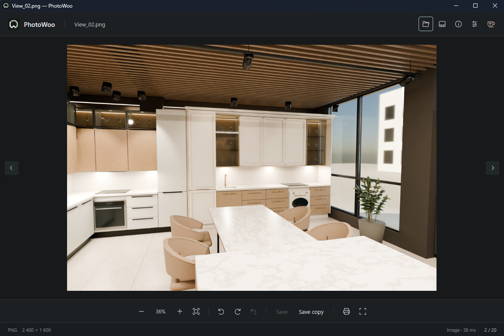
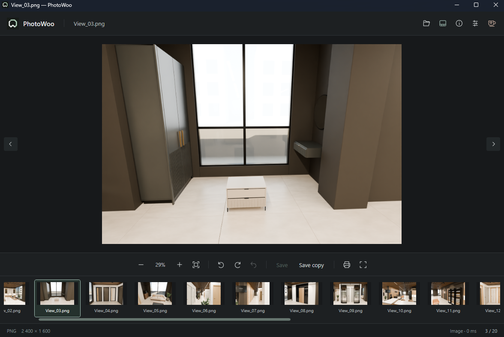
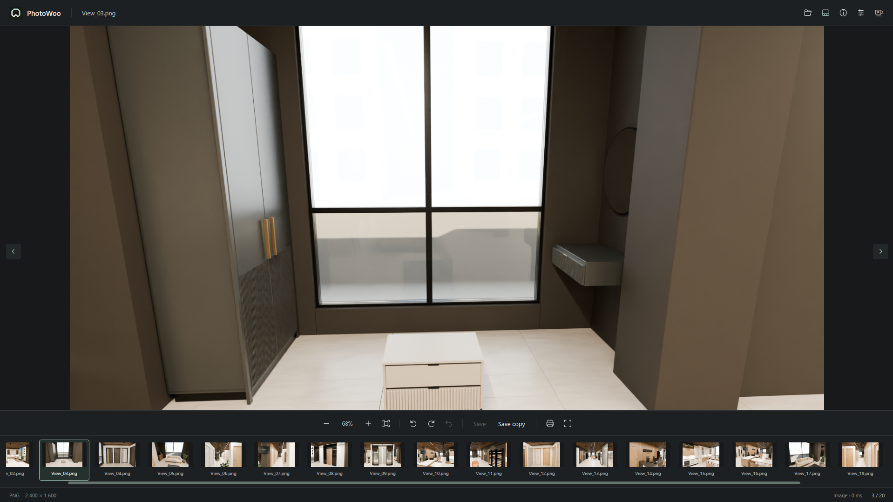
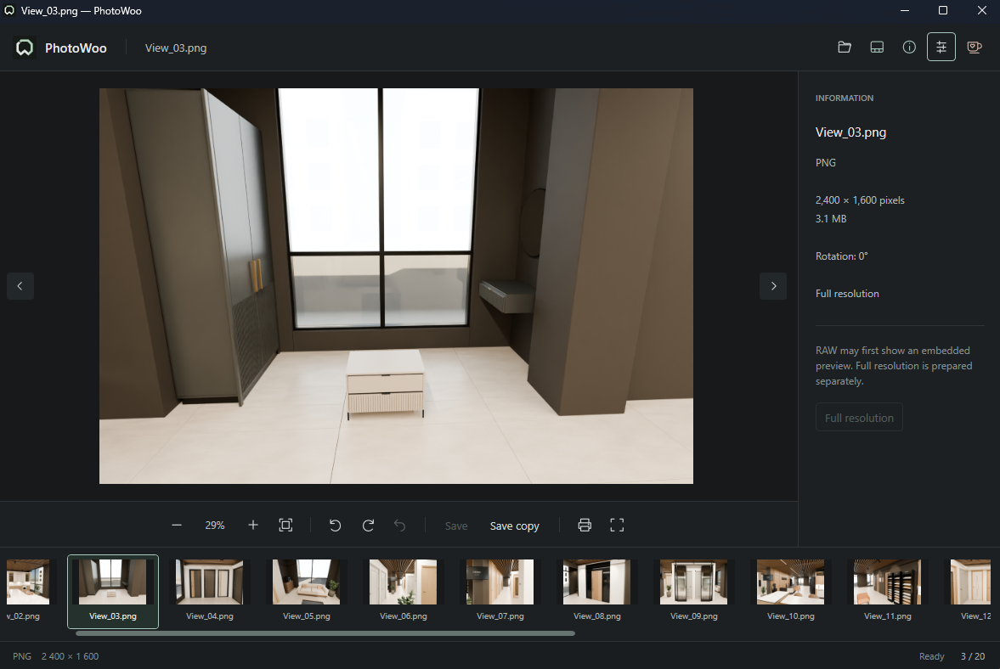
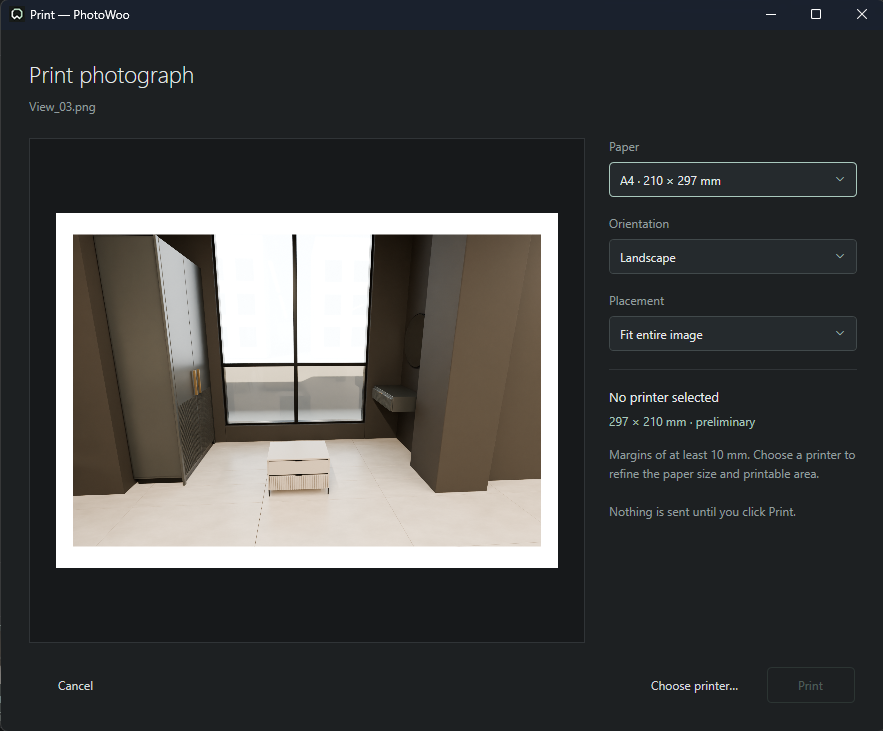
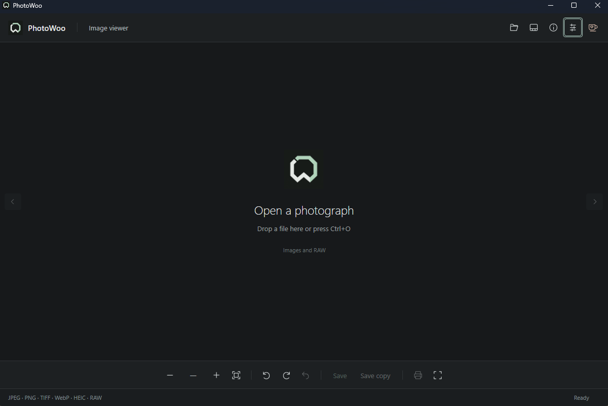
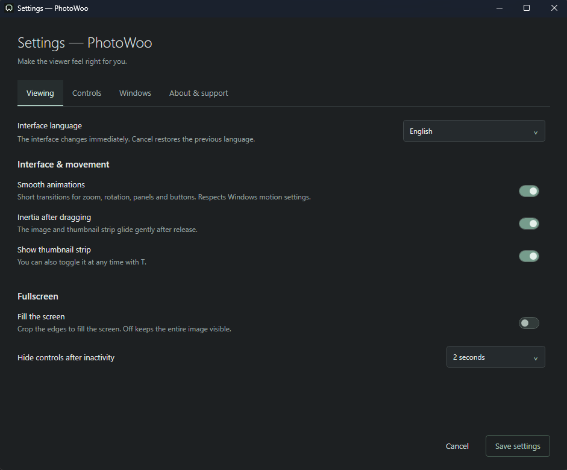

# PhotoWoo

A Windows image viewer with a quiet dark interface, RAW previews, printing and an immersive fullscreen mode.


## Download

Get the Windows x64 ZIP from [Releases](https://github.com/thewoolfi/PhotoWoo/releases). Extract the entire folder and run **PhotoWoo.exe**. The portable build includes .NET; keep its accompanying files beside the executable.



## Features

- JPEG, PNG, TIFF, BMP, WebP, HEIC, ICO and camera RAW through WIC and Magick.NET/LibRaw. RAW support depends on the camera and decoder version.
- Embedded RAW previews for quick viewing, with full-resolution decoding on request.
- Zoom, pan, folder navigation and a filmstrip with mouse-wheel scrolling and drag inertia.
- Fullscreen photography with controls that appear on movement and disappear when idle. Fit preserves the whole image; optional fill crops its edges to cover the display.
- Rotation, undo, save and save a copy. RAW originals are never overwritten.
- Print preview, page orientation and image placement, followed by the Windows printer dialog.
- Settings for animations, inertia, fullscreen behavior, language and Windows file associations.
- Manual and automatic update checks, with verified downloads and confirmed installation from GitHub Releases.
- English, Russian, German, French, Spanish, Italian, Portuguese, Polish, Ukrainian and Simplified Chinese. System dialogs follow Windows language settings.

## Screenshots

<details>
<summary>Explore the filmstrip, fullscreen view, printing and settings</summary>

| Filmstrip navigation | Fullscreen with controls visible |
| --- | --- |
|  |  |

| Image information | Print preview |
| --- | --- |
|  |  |

| Start screen | Viewing settings |
| --- | --- |
|  |  |

</details>

## Updates

Open **Settings → Updates → Check for updates** to check manually. Automatic checks are enabled by default and run shortly after startup and every 30 minutes while PhotoWoo is open. They can be turned off in Settings. A new release adds an **Update** button to the viewer; background checks never interrupt a photo or install anything automatically.

Choose **Download update**, then **Install and restart** when ready. PhotoWoo verifies the ZIP with SHA-256, asks about unsaved rotation, replaces its application files and reopens the current image. Photos, settings and other files in the application folder are preserved. Close other copies of PhotoWoo before installing; the portable folder must be writable. If file replacement fails, the updater attempts to restore the previous files.

Updates come from published stable [GitHub Releases](https://github.com/thewoolfi/PhotoWoo/releases), not individual commits. Releases use tags such as `v0.5.0` matching the project version; the Windows workflow builds the ZIP, adds its checksum and publishes it. Version 0.4 and earlier need one manual download to gain the updater.

## Controls

| Action | Shortcut |
|---|---|
| Open | Ctrl+O |
| Previous / next image | ← / → |
| Rotate right / left | R / Shift+R |
| Save / save a copy | Ctrl+S / Ctrl+Shift+S |
| Undo rotation | Ctrl+Z |
| Print | Ctrl+P |
| Filmstrip / information | T / I |
| Fullscreen / exit fullscreen | F or F11 / Escape |
| Fit / zoom | 0 / + or − |
| Controls reference | F1 |

The mouse wheel zooms over the image and scrolls horizontally over the filmstrip. Drag a fitted image to navigate; drag a zoomed image to pan. Double-click switches between fit and 100%.

## File associations

Keep PhotoWoo in a permanent folder, then open **Settings → Windows** to register it. Choose supported formats in Windows Default Apps. Existing defaults are not changed automatically. Registered files use PhotoWoo’s document icon where Explorer displays icons instead of thumbnails.

## Build

Requires Windows x64 and the .NET 9 SDK.

```powershell
./build.ps1
# Output: dist/PhotoWoo-0.5.0/PhotoWoo.exe
```

The application uses WPF and Magick.NET 14.16.0. Dependency notices are included in the portable build’s `licenses` directory.

## Current limitations

This is an early release. JPEG rotation is re-encoded at quality 95; lossless JPEG rotation is not implemented. Animated and multipage files show the first frame, except ICO, which selects the largest suitable icon. Detected multiframe originals cannot be overwritten. Full RAW rendering can differ from the camera’s embedded preview. Physical printing, every RAW camera model, HDR and all colour-profile combinations have not been verified.

Settings are stored in `%LOCALAPPDATA%/PhotoWoo/settings.json`. The support button opens the creator’s [Boosty page](https://boosty.to/andrewwoolfi) in the default browser; PhotoWoo does not collect payments.
