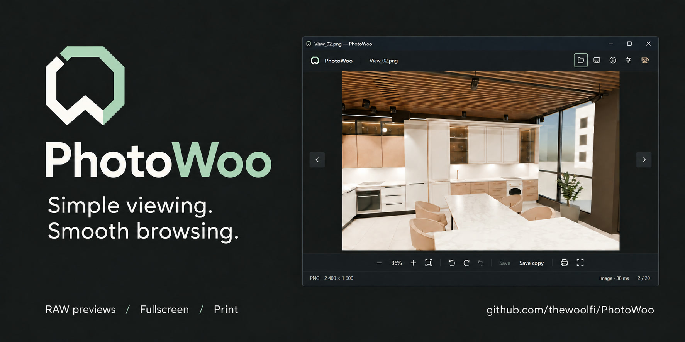
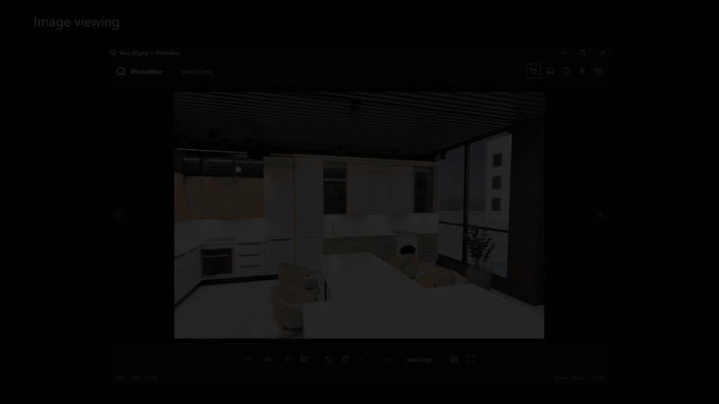

# PhotoWoo

A desktop image viewer with a quiet dark interface, RAW previews, basic GLB/glTF viewing, printing and an immersive fullscreen mode. The current release runs on Windows.


## Download

Get the Windows x64 ZIP from [Releases](https://github.com/thewoolfi/PhotoWoo/releases). Extract the entire folder and run **PhotoWoo.exe**. The portable build includes .NET; keep its accompanying files beside the executable.


## Features

- 145 recognized file extensions, including JPEG, PNG, TIFF, BMP, WebP, HEIC, AVIF, JPEG XL, JPEG XR, SVG/SVGZ, QOI, ICO/CUR/ANI, PNG-based ICNS and camera RAW. Decoding depends on the file variant and, for RAW, the camera.
- Photoshop and GIMP images, merged previews from Krita/OpenRaster documents, and additional scientific and legacy image formats including EXR, HDR, FITS, DICOM, PCX, PICT, Targa, SGI, Netpbm, WMF and EMF.
- Basic glTF 2.0 model viewing (.glb and .gltf): textures, orbit, pan, zoom, drag inertia and reset view in the same window. Models open from Explorer, drag-and-drop or the file dialog.
- Embedded RAW previews for quick viewing, with full-resolution decoding on request.
- Zoom, pan, folder navigation and a filmstrip with mouse-wheel scrolling and drag inertia.
- Fullscreen photography with controls that appear on movement and disappear when idle. Fit preserves the whole image; optional fill crops its edges to cover the display.
- Rotation, undo, save and save a copy. RAW originals are never overwritten.
- Print preview, page orientation and image placement, followed by the Windows printer dialog.
- Settings for animations, inertia, fullscreen behavior, language and Windows file associations.
- Manual and automatic update checks, with verified downloads and confirmed installation from GitHub Releases.
- English, Russian, German, French, Spanish, Italian, Portuguese, Polish, Ukrainian and Simplified Chinese. System dialogs follow Windows language settings.

## Screenshots



[Watch the 28-second overview](docs/media/photowoo-overview.mp4), made from application screenshots.

<details>
<summary>Explore the filmstrip, fullscreen view, printing and settings</summary>

| Filmstrip navigation | Fullscreen with controls visible |
| --- | --- |
|  |  |

| Image information | Print preview |
| --- | --- |
|  |  |

| Start screen | Viewing settings |
| --- | --- |
|  |  |

</details>

## Updates

Open **Settings → Updates → Check for updates** to check manually. Automatic checks are enabled by default and run shortly after startup and every 30 minutes while PhotoWoo is open. They can be turned off in Settings. A new release adds an **Update** button to the viewer; background checks never interrupt a photo or install anything automatically.

Choose **Download update**, then **Install and restart** when ready. PhotoWoo verifies the ZIP with SHA-256, asks about unsaved rotation, replaces its application files and reopens the current image. Photos, settings and other files in the application folder are preserved. Close other copies of PhotoWoo before installing; the portable folder must be writable. If file replacement fails, the updater attempts to restore the previous files.

Updates come from published stable [GitHub Releases](https://github.com/thewoolfi/PhotoWoo/releases), not individual commits. Releases use tags such as `v0.5.0` matching the project version; the Windows workflow builds the ZIP, adds its checksum and publishes it. Version 0.4 and earlier need one manual download to gain the updater.

## Controls

| Action | Shortcut |
|---|---|
| Open | Ctrl+O |
| Previous / next image | ← / → |
| Rotate right / left | R / Shift+R |
| Save / save a copy | Ctrl+S / Ctrl+Shift+S |
| Undo rotation | Ctrl+Z |
| Print | Ctrl+P |
| Filmstrip / information | T / I |
| Fullscreen / exit fullscreen | F or F11 / Escape |
| Fit / zoom | 0 / + or − |
| Controls reference | F1 |

The mouse wheel zooms over the image and scrolls horizontally over the filmstrip. Drag a fitted image to navigate; drag a zoomed image to pan. Double-click switches between fit and 100%.

For 3D models, drag with the left button to orbit. Right-drag, middle-drag or Shift-drag pans; the wheel and +/− zoom. Double-click, 0 or the fit button resets the camera. Image editing and printing controls are hidden in 3D mode.

## File associations

Keep PhotoWoo in a permanent folder, then use **Settings → Windows → Choose as default app**. The button registers all supported extensions and opens PhotoWoo's page in Windows 11 Default Apps (the general page on Windows 10). Complete the selection there; Windows requires its system interface to confirm default-app changes. PhotoWoo shows how many extensions currently use it and refreshes the count when you return.

Use the button again after an update adds formats. Registered files use PhotoWoo's document icon where Explorer displays icons instead of thumbnails.

## Build

Requires Windows x64 and the .NET 9 SDK.

```powershell
./build.ps1
# Output: dist/PhotoWoo-0.6.1/PhotoWoo.exe
```

The application uses WPF, Magick.NET 14.16.0 and SharpGLTF 1.0.7. Dependency notices are included in the portable build's licenses directory.

## Current limitations

This is an early release. JPEG rotation is re-encoded at quality 95; lossless JPEG rotation is not implemented. Animated and multipage files show the first frame, except ICO/CUR and PNG-based ICNS, which select the largest suitable icon. ANI shows its first icon frame. Detected multiframe originals cannot be overwritten. Krita/OpenRaster require a mergedimage.png preview. Legacy ICNS representations without PNG and SVG external files, scripts and HTML are not supported. Full RAW rendering can differ from the camera's embedded preview. Physical printing, every RAW camera model, HDR and all colour-profile combinations have not been verified.

3D viewing uses simplified diffuse lighting and base-color textures, with models in their default pose. Animation playback, full PBR shading, vertex colors, Draco/meshopt compression and KTX2-only textures are not supported. Transparent materials may have sorting differences. Model resources must be in the model's folder or a subfolder, with no network resources or filesystem links. The viewer limits scenes to 2 million vertices/triangles, input resources to 512 MB (256 MB per file), and decoded textures to 128 MB; textures are limited to 2048 pixels on their longest side. This is a viewer, without 3D editing or saving.

Settings are stored in `%LOCALAPPDATA%/PhotoWoo/settings.json`. The support button opens the creator’s [Boosty page](https://boosty.to/andrewwoolfi) in the default browser; PhotoWoo does not collect payments.
